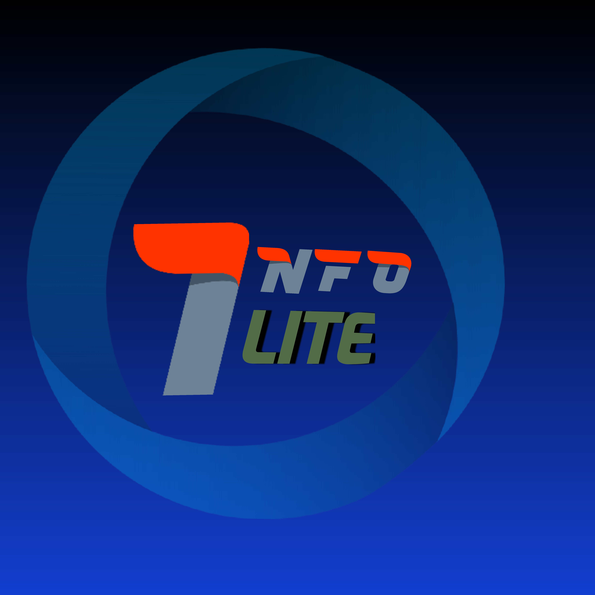

<h1 align="center">Hello 👋, I'm KAVIN</h1>
<h3 align="center"> Developer from India</h3>
• 𝐼'𝑚 ᴋᴀᴠɪʏᴀʀᴀsᴀɴ, 𝑀.𝑆𝑐 𝑔𝑟𝑎𝑑𝑢𝑎𝑡𝑒 𝑏𝑢𝑡 𝐼'𝑚 𝑛𝑜𝑡 𝑎 𝑏𝑜𝑜𝑘𝑖𝑠ℎ 𝑝𝑒𝑟𝑠𝑜𝑛.

• 𝐼 ℎ𝑎𝑣𝑒 𝑎 𝑘𝑒𝑒𝑛 𝑖𝑛𝑡𝑒𝑟𝑒𝑠𝑡 𝑡𝑜 𝑏𝑒𝑐𝑜𝑚𝑒 𝑎 𝑦𝑜𝑢𝑡𝑢𝑏𝑒𝑟 𝑎𝑛𝑑 𝑎𝑙𝑠𝑜 𝐼 𝑠𝑡𝑎𝑟𝑡𝑒𝑑 𝑡ℎ𝑎𝑡 𝑡𝑜𝑜. 𝑌𝑎! 𝐼'𝑚 𝑎 𝑏𝑢𝑑𝑑𝑖𝑛𝑔 𝑦𝑜𝑢𝑡𝑢𝑏𝑒𝑟 𝑎𝑛𝑑 𝑚𝑦 𝑐ℎ𝑎𝑛𝑛𝑒𝑙 𝑛𝑎𝑚𝑒 𝑖𝑠 ᴋᴀᴠɪʏᴀʀᴀsᴀɴ

• 𝐷𝑜𝑛'𝑡 𝑓𝑜𝑟𝑔𝑒𝑡 𝑡𝑜 𝑔𝑖𝑣𝑒 𝑎 𝑣𝑖𝑠𝑖𝑡 𝑡𝑜 𝑚𝑦 𝑐ℎ𝑎𝑛𝑛𝑒𝑙. 𝐴𝑛𝑑 𝑦𝑒𝑠, 𝐼 𝑎𝑚 𝑎 𝑏𝑢𝑑𝑑𝑖𝑛𝑔 𝑏𝑙𝑜𝑔𝑔𝑒𝑟 𝑎𝑡 "ᴋᴀᴠɪʏᴀʀᴀsᴀɴ". 𝐴𝑛𝑑 𝑜𝑛𝑒 𝑚𝑜𝑟𝑒 𝑖𝑚𝑝𝑜𝑟𝑡𝑎𝑛𝑡 𝑡ℎ𝑖𝑛𝑔, 𝐼'𝑚 𝑎 𝑙𝑒𝑓𝑡𝑖𝑠𝑡 𝑡ℎ𝑖𝑛𝑘𝑒𝑟 𝑎𝑛𝑑 ℎ𝑎𝑣𝑒 𝑙𝑜𝑡𝑠 𝑜𝑓 𝑖𝑛𝑡𝑒𝑟𝑒𝑠𝑡 𝑖𝑛 𝑝𝑜𝑙𝑖𝑡𝑖𝑐𝑠 𝑠𝑜 𝐼 𝑠𝑡𝑟𝑜𝑛𝑔𝑙𝑦 𝑏𝑒𝑙𝑖𝑒𝑣𝑒 𝑡ℎ𝑎𝑡

 

  
     

 

<code>Social Media Pages</code>
<a href="https://infolite-in.github.io/biodata/"> <a href="https://youtube.com/@infotalkies?si=EnSIkaIECMiOmarE">    

  

 <code>📊  GITHUB STATUS</code> 

 
 

  
  
 

<code>🧑🏽‍💻MY PROFILE Details</code>

SPONSORS|<a href="https://github.com/KAVIYARASAN-1997/inflite-in/blob/main/sponsor.md">MY SPONSORSHIPS</a>

Language and tools<a href="https://github.com/KAVIYARASAN-1997/KAVIYARASAN-1997/blob/main/Language.md">Language Tools</a>
Achievements<a href="https://github.com/KAVIYARASAN-1997/KAVIYARASAN-1997/blob/main/Achievements.md">Achievements</a>
Cantact and Updates<a href="https://github.com/KAVIYARASAN-1997/KAVIYARASAN-1997/blob/main/Update.md">Cantact</a>
 

