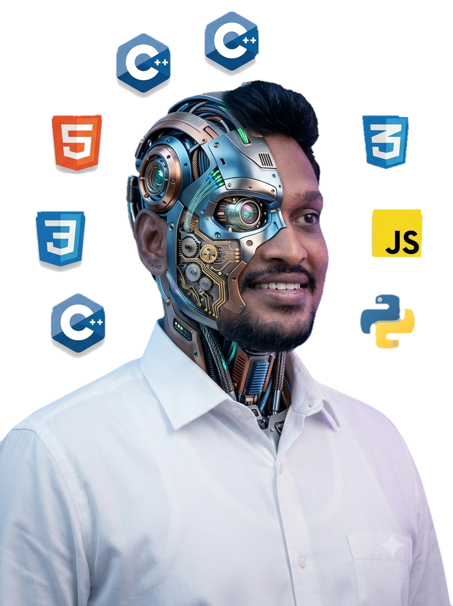

   

  

 
<h2>╔══════════════════════════════════╗</h2>
<h2>　👋 𝑨𝑩𝑶𝑼𝑻 𝑴𝑬　</h2>
<h2>╚══════════════════════════════════╝</h2>

<b>𝙃𝙚𝙡𝙡𝙤! 𝙄'𝙢 𝙆𝙖𝙫𝙞𝙮𝙖𝙧𝙖𝙨𝙖𝙣</b> 👋

<em>Full-Stack Developer • Android Developer • Tech Creator</em>

I build practical, modern and responsive digital products across
<b>Web • Android • APIs • Databases • Cloud</b>.

 
"🌐 WEB"　"📱 ANDROID"　"⚛️ REACT"　"🟢 NODE.JS"
"🗄️ DATABASE"　"☁️ CLOUD"　"🎨 UI / UX"　"🎥 TECH CONTENT"

 
«“𝘽𝙪𝙞𝙡𝙙 𝙪𝙨𝙚𝙛𝙪𝙡 𝙩𝙝𝙞𝙣𝙜𝙨. 𝙆𝙚𝙚𝙥 𝙩𝙝𝙚𝙢 𝙨𝙞𝙢𝙥𝙡𝙚. 𝙆𝙚𝙚𝙥 𝙞𝙢𝙥𝙧𝙤𝙫𝙞𝙣𝙜.”»

---

<h2>⚡ 𝑻𝑬𝑪𝑯𝑵𝑶𝑳𝑶𝑮𝒀 𝑺𝑻𝑨𝑪𝑲</h2>
<i>Tools I use to turn ideas into working products.</i>
 <h3>💻 𝙇𝘼𝙉𝙂𝙐𝘼𝙂𝙀𝙎 & 𝙁𝙍𝘼𝙈𝙀𝙒𝙊𝙍𝙆𝙎</h3>  

<h3>🗄️ 𝘿𝘼𝙏𝘼 & 𝘾𝙇𝙊𝙐𝘿</h3>  

<h3>🛠️ 𝘿𝙀𝙑𝙀𝙇𝙊𝙋𝙈𝙀𝙉𝙏 𝙏𝙊𝙊𝙇𝙎</h3>
---

<h2>🚀 𝑭𝑬𝑨𝑻𝑼𝑹𝑬𝑫 𝑷𝑹𝑶𝑱𝑬𝑪𝑻𝑺</h2>
<table align="center">
<tr>
<th>🚀 PROJECT</th>
<th>🎯 FOCUS</th>
<th>⚙️ TECHNOLOGY</th>
</tr><tr>
<td><b>🔴 DYFI Tamil Nadu</b></td>
<td>Digital Platform & Application</td>
<td>HTML · CSS · JavaScript · Android</td>
</tr><tr>
<td><b>🎮 GAMEND</b></td>
<td>Gaming Digital Platform</td>
<td>JavaScript · Firebase</td>
</tr><tr>
<td><b>📰 InfoTalkies</b></td>
<td>Tamil Technology Content</td>
<td>Web · YouTube · Social</td>
</tr><tr>
<td><b>📊 Daily Data</b></td>
<td>Data Management & Reporting</td>
<td>HTML · CSS · JavaScript</td>
</tr></table>---

<h2>📊 𝑮𝑰𝑻𝑯𝑼𝑩 𝑶𝑽𝑬𝑹𝑽𝑰𝑬𝑾</h2> 
---

<h2>🎥 𝑰𝑵𝑭𝑶𝑻𝑨𝑳𝑲𝑰𝑬𝑺</h2>

<b>𝙏𝙚𝙘𝙝 𝙞𝙣 𝙏𝙖𝙢𝙞𝙡</b> 🇮🇳

Latest Tech News • AI Updates • Apps • Tips & Tricks • Developer Content

 
---

<h2>🌐 𝑪𝑶𝑵𝑵𝑬𝑪𝑻</h2>
<b>𝑫𝑬𝑽𝑬𝑳𝑶𝑷𝑬𝑹</b>
  

<b>𝑰𝑵𝑭𝑶𝑻𝑨𝑳𝑲𝑰𝑬𝑺</b>

---

<h2>⚡ 𝑴𝑰𝑵𝑫𝑺𝑬𝑻</h2> 

  

<em>𝙎𝙞𝙢𝙥𝙡𝙚 𝙘𝙤𝙙𝙚. 𝘾𝙡𝙚𝙖𝙣 𝙙𝙚𝙨𝙞𝙜𝙣. 𝙍𝙚𝙖𝙡 𝙥𝙧𝙤𝙟𝙚𝙘𝙩𝙨.</em>

 

